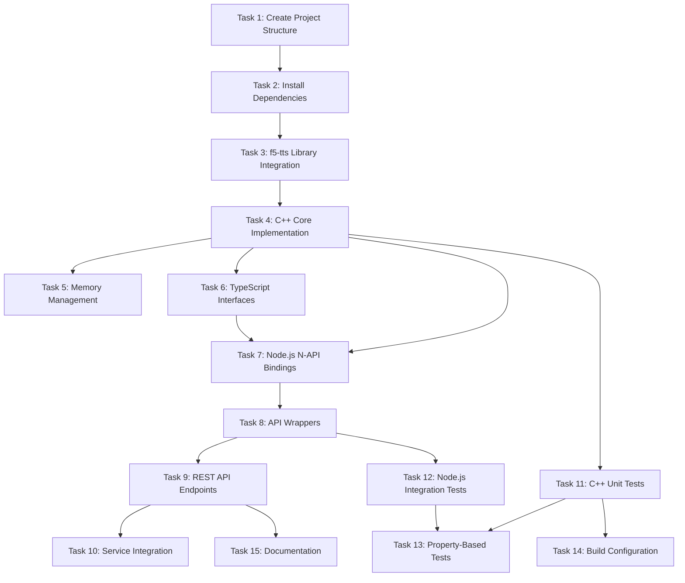

# Implementation Plan: Voice Cloning Addon

## Overview

This task list implements the voice cloning Node.js C++ addon based on the requirements and design documents.

## Task Dependency Graph

## Tasks

### Phase 1: Setup & Environment Preparation

- [ ] **1. Create Project Structure** (voice-cloning-addon-setup-1)
  - **Priority**: critical
  - **Estimated Time**: 1h
  - **Dependencies**: 
  - **Description**: Create the voice-cloning-addon package structure within the EchoForge Nx monorepo.
  - **Implementation Steps**:
    1. Create package directory: `packages/voice-cloning-addon/`
    2. Add package.json with appropriate metadata
    3. Create basic directory structure:
       - `src/` - TypeScript source code
       - `src/cpp/` - C++ source code  
       - `include/` - C++ headers
       - `tests/` - Test files
       - `models/` - Model storage
    4. Configure Nx project configuration
    5. Update workspace configuration
  - **Acceptance Criteria**:
    - Package directory created with proper structure
    - Nx recognizes the new package
    - Basic build configuration works
    - Linting passes

- [ ] **2. Install Dependencies** (voice-cloning-addon-setup-2)
  - **Priority**: critical
  - **Estimated Time**: 2h
  - **Dependencies**: 1
  - **Description**: Install all required system and development dependencies.
  - **Implementation Steps**:
    1. Add f5-tts as git submodule: `third_party/f5-tts`
    2. Install C++ dependencies: libsndfile, portaudio
    3. Add Node.js dependencies: node-gyp, @types/node
    4. Install build tools: CMake, make, g++
    5. Add development dependencies: testing frameworks
    6. Configure GPU support dependencies (optional)
  - **Acceptance Criteria**:
    - f5-tts library available as submodule
    - System dependencies installed and verified
    - Build tools configured properly
    - Development environment ready

### Phase 2: Voice Cloning C++ Addon

- [ ] **3. f5-tts Library Integration** (voice-cloning-addon-core-1)
  - **Priority**: high
  - **Estimated Time**: 4h
  - **Dependencies**: 2
  - **Description**: Integrate the f5-tts C++ library with proper build configuration.
  - **Implementation Steps**:
    1. Create CMake configuration for f5-tts
    2. Build f5-tts as static library
    3. Create wrapper headers for f5-tts functionality
    4. Implement model loading interface
    5. Add error handling for library initialization
    6. Test basic library functionality
  - **Acceptance Criteria**:
    - f5-tts builds successfully
    - Models can be loaded from disk
    - Basic voice processing functions work
    - Memory management configured

- [ ] **4. C++ Core Implementation** (voice-cloning-addon-core-2)
  - **Priority**: high
  - **Estimated Time**: 6h
  - **Dependencies**: 3
  - **Description**: Implement core voice cloning functionality in C++.
  - **Implementation Steps**:
    1. Create audio processing utilities (format conversion, resampling)
    2. Implement voice embedding extraction using f5-tts
    3. Create text-to-speech synthesis pipeline
    4. Add audio post-processing (normalization, enhancement)
    5. Implement configuration management
    6. Add logging and debugging support
  - **Acceptance Criteria**:
    - Audio files can be loaded and processed
    - Voice embeddings extracted from samples
    - Text-to-speech synthesis produces audio
    - Processing pipeline works end-to-end
    - Configuration affects behavior as expected

- [ ] **5. Memory Management** (voice-cloning-addon-core-3)
  - **Priority**: medium
  - **Estimated Time**: 3h
  - **Dependencies**: 4
  - **Description**: Implement efficient memory management for audio processing.
  - **Implementation Steps**:
    1. Create memory pool for audio buffers
    2. Implement shared model memory between requests
    3. Add GPU memory management (if applicable)
    4. Create cache for voice embeddings
    5. Implement resource cleanup on shutdown
    6. Add memory usage monitoring
  - **Acceptance Criteria**:
    - No memory leaks in processing pipeline
    - Memory usage stays within configured limits
    - Cache improves performance for repeated voices
    - Resources properly cleaned up

### Phase 3: Node.js Interface Layer

- [ ] **6. TypeScript Interfaces** (voice-cloning-addon-interface-1)
  - **Priority**: high
  - **Estimated Time**: 2h
  - **Dependencies**: 1
  - **Description**: Create TypeScript interfaces and type definitions.
  - **Implementation Steps**:
    1. Define `VoiceSampleInput` interface
    2. Define `TranscriptionInput` interface  
    3. Define `VoiceCloningOutput` interface
    4. Define `VoiceCloningJob` interface
    5. Create configuration interfaces
    6. Add error type definitions
  - **Acceptance Criteria**:
    - All interfaces defined with proper TypeScript types
    - Interfaces match C++ data structures
    - Type definitions exported properly
    - Documentation comments added

- [ ] **7. Node.js N-API Bindings** (voice-cloning-addon-interface-2)
  - **Priority**: high
  - **Estimated Time**: 4h
  - **Dependencies**: 4, 6
  - **Description**: Create Node.js N-API bindings for C++ functionality.
  - **Implementation Steps**:
    1. Create N-API module initialization
    2. Bind voice embedding extraction function
    3. Bind text-to-speech synthesis function
    4. Add configuration getter/setter functions
    5. Implement error handling bridge
    6. Add memory management wrappers
    7. Create async worker for long-running operations
  - **Acceptance Criteria**:
    - Node.js can load the addon module
    - Functions exposed with proper JavaScript signatures
    - Async operations return Promises
    - Errors propagate correctly to JavaScript
    - Memory management works across boundary

- [ ] **8. API Wrappers** (voice-cloning-addon-interface-3)
  - **Priority**: medium
  - **Estimated Time**: 3h
  - **Dependencies**: 7
  - **Description**: Create high-level JavaScript/TypeScript API wrappers.
  - **Implementation Steps**:
    1. Create `VoiceCloner` class with clean API
    2. Implement input validation in JavaScript
    3. Add configuration management wrapper
    4. Create utility functions for audio handling
    5. Add progress reporting for long operations
    6. Implement result caching layer
  - **Acceptance Criteria**:
    - Clean, intuitive API for voice cloning
    - Input validation catches invalid parameters
    - Configuration can be changed at runtime
    - Progress events emitted for long operations
    - Results cached appropriately

### Phase 4: Backend Integration

- [ ] **9. REST API Endpoints** (voice-cloning-addon-backend-1)
  - **Priority**: high
  - **Estimated Time**: 3h
  - **Dependencies**: 8
  - **Description**: Create REST API endpoints in backend service.
  - **Implementation Steps**:
    1. Create `voice.service.ts` service module
    2. Add `/voice/clone` POST endpoint
    3. Implement file upload handling for voice samples
    4. Add job status endpoint `/voice/jobs/:id`
    5. Create result download endpoint
    6. Add request validation middleware
    7. Implement rate limiting
  - **Acceptance Criteria**:
    - REST endpoints accept voice samples and text
    - File uploads work correctly
    - Job status can be queried
    - Results can be downloaded
    - Rate limiting prevents abuse

- [ ] **10. Service Integration** (voice-cloning-addon-backend-2)
  - **Priority**: medium
  - **Estimated Time**: 2h
  - **Dependencies**: 9
  - **Description**: Integrate voice cloning with existing backend services.
  - **Implementation Steps**:
    1. Integrate with storage service for file management
    2. Add authentication middleware to endpoints
    3. Integrate with existing logging system
    4. Add metrics collection for voice cloning operations
    5. Create database schema for job tracking
    6. Implement cleanup job for old voice data
  - **Acceptance Criteria**:
    - Voice files stored using storage service
    - Authentication required for voice cloning
    - Operations logged properly
    - Metrics collected for monitoring
    - Jobs tracked in database

### Phase 5: Testing & Validation

- [ ] **11. C++ Unit Tests** (voice-cloning-addon-tests-1)
  - **Priority**: high
  - **Estimated Time**: 4h
  - **Dependencies**: 4
  - **Description**: Create comprehensive unit tests for C++ code.
  - **Implementation Steps**:
    1. Set up Google Test framework
    2. Test audio processing utilities
    3. Test voice embedding extraction
    4. Test text-to-speech synthesis
    5. Test error handling paths
    6. Test memory management
    7. Add benchmark tests for performance
  - **Acceptance Criteria**:
    - Unit tests cover all major C++ functions
    - Tests pass in CI environment
    - Performance benchmarks established
    - Memory leak tests included

- [ ] **12. Node.js Integration Tests** (voice-cloning-addon-tests-2)
  - **Priority**: high
  - **Estimated Time**: 3h
  - **Dependencies**: 8
  - **Description**: Create integration tests for Node.js bindings.
  - **Implementation Steps**:
    1. Set up Jest testing framework
    2. Test N-API bindings with mock data
    3. Test TypeScript interfaces
    4. Test error propagation from C++
    5. Test async operation handling
    6. Test configuration management
    7. Add end-to-end test with sample audio
  - **Acceptance Criteria**:
    - Integration tests cover JavaScript API
    - Tests validate type safety
    - Error handling tested thoroughly
    - Async operations tested properly

- [ ] **13. Property-Based Tests** (voice-cloning-addon-tests-3)
  - **Priority**: medium
  - **Estimated Time**: 4h
  - **Dependencies**: 11, 12
  - **Description**: Create property-based tests for voice cloning correctness.
  - **Implementation Steps**:
    1. Set up property-based testing framework
    2. Test voice similarity property (CP-8)
    3. Test audio quality property (CP-7)
    4. Test idempotency property (CP-3)
    5. Test memory management property (CP-1)
    6. Test error recovery property
    7. Test performance property (SR-8)
  - **Acceptance Criteria**:
    - Property-based tests cover all correctness properties
    - Tests generate random valid/invalid inputs
    - Edge cases tested thoroughly
    - Properties validated statistically

### Phase 6: Deployment & Monitoring

- [ ] **14. Build Configuration** (voice-cloning-addon-deploy-1)
  - **Priority**: high
  - **Estimated Time**: 2h
  - **Dependencies**: 11
  - **Description**: Configure build system for production deployment.
  - **Implementation Steps**:
    1. Create production build configuration
    2. Optimize build for performance
    3. Add model bundling configuration
    4. Configure cross-platform builds
    5. Create CI/CD pipeline configuration
    6. Add versioning and release process
  - **Acceptance Criteria**:
    - Production builds optimized
    - Models included in deployment
    - Cross-platform support configured
    - CI/CD pipeline works

### Phase 7: Documentation

- [ ] **15. Documentation** (voice-cloning-addon-docs-1)
  - **Priority**: low
  - **Estimated Time**: 2h
  - **Dependencies**: 9
  - **Description**: Create comprehensive API documentation.
  - **Implementation Steps**:
    1. Generate OpenAPI/Swagger documentation
    2. Create usage examples
    3. Add troubleshooting guide
    4. Create integration guide
    5. Add performance tuning guide
    6. Create security considerations document
  - **Acceptance Criteria**:
    - API documentation complete
    - Usage examples provided
    - Integration guide available
    - Troubleshooting documented

## Notes

1. **Testing Strategy**: All code must include appropriate tests before moving to production
2. **Performance Requirements**: Voice cloning must complete within 30 seconds for 30-second samples
3. **Memory Management**: C++ code must not leak memory under any conditions
4. **Error Handling**: All functions must handle errors gracefully and provide useful error messages
5. **Security**: Input validation is critical to prevent malicious content execution
6. **Privacy**: Voice data must be handled according to privacy regulations
7. **Integration**: Must work with existing EchoForge backend architecture
8. **Cross-Platform**: Initial support for Linux and macOS, with Windows optional
9. **GPU Support**: Optional GPU acceleration for improved performance
10. **Monitoring**: Comprehensive metrics and logging for production deployment

## Success Criteria

The implementation will be considered successful when:

1. **Functional Requirements Met**:
   - Voice samples can be uploaded and processed
   - Text can be synthesized with cloned voices
   - Audio output matches voice characteristics

2. **Performance Requirements Met**:
   - Processing completes within 30 seconds
   - System handles concurrent requests
   - Memory usage stays within limits

3. **Quality Requirements Met**:
   - No memory leaks in C++ addon
   - Tests cover all major functionality
   - Error handling works properly

4. **Integration Requirements Met**:
   - Integrates with existing backend
   - Works with storage service
   - Includes proper monitoring